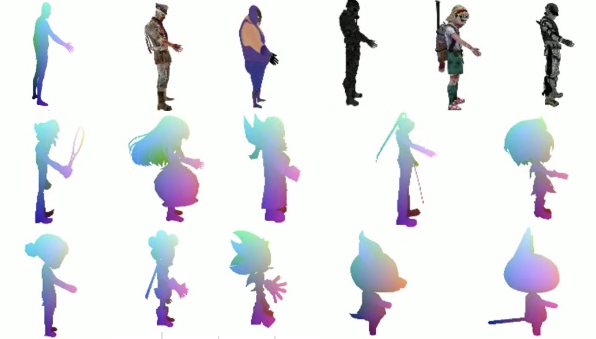

# Pose2Carton 

EE228 课程大作业，利用3D骨架控制3D卡通人物。

# Maya 环境配置

首先下载Maya2022，安装后将会自动安装mayapy解释器，其路径一般为../bin/mayapy。如果是MacOS系统，我们可以手动将其添加到环境变量中去，并将解释器的默认目录相对路径改为我们的项目文件夹，这样在终端可以直接输入mayapy fbx_parser.py ..(filename)命令解析fbx文件。当然，也可以在VS Code中直接选择mayapy解释器运行fbx_parser脚本。首次运行时还会有一些工具包缺失，如h5等。在终端中手动安装即可。完成以上操作后即可正常运行。

# 匹配流程

首先，对fbx文件作解析。在终端中mayapy解释器下调用fbx_parser脚本，将fbx文件分解为obj格式的mesh文件，以及包含skeleton关键点信息和其余点的受控信息(skin weight)。

然后，调用transfer.py脚本，第一次空缺匹配字典mapping，将main函数中transfer_one_sequence函数的传入参数分别改为parse出的.obj文件和obj-seq-5.pkl。运行后控制台会输出解析出的运动学树和各关键节点索引。利用这些索引，结合Blender中对关键点位置的查看，一一匹配卡通人物和human的关键点，匹配映射填入匹配字典，再次运行transfer.py脚本，可以得到447帧匹配结果，存储在3d_model文件夹中。对于transfer和vis脚本，都需要根据是否蒙皮选择from_internet开关的状态。在transfer.py脚本中，提供了用于标准命名懒人匹配的_lazy_get_model_to_smpl函数、清空.txt文件中前缀的clean_info函数、清空.obj文件中的注释和节点颜色(Maya不支持这些字段)的clean_obj函数、重排列旋转向量至旋转矩阵的rodrigues函数、将模型转换为给定动作的transfer_given_pose(这是transfer.py脚本的核心函数),以及调用这些函数的transfer_one_frame和transfer_one_sequence函数(这是transfer.py脚本的主函数)。 

随后，如果需要对蒙皮结果可视化，应该将parse得到的表皮.png文件和.mtl文件一同放入3d_model文件夹中，若为Windows系统，则还需要修改.mtl文件中的相对路径，修改方式详见实验报告。  

最后，运行vis.py脚本，在Open3D视窗中会逐一播放匹配结果。播放完毕后关闭视窗，vis.py脚本将自动转换为.mp4文件，与每帧图像一起储存在vis文件夹下。  

# 项目结果

# 协议 
本项目在 Apache-2.0 协议下开源

所涉及代码及数据的最终解释权归倪冰冰老师课题组所有

Group 1
